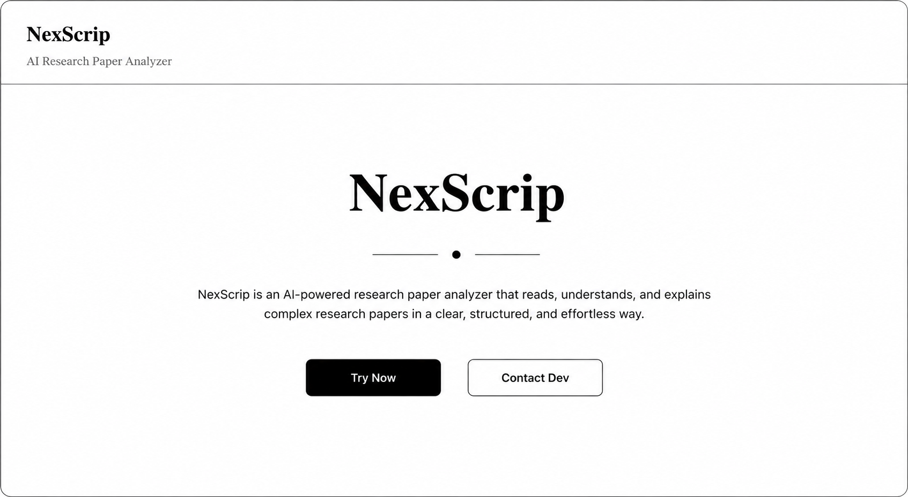
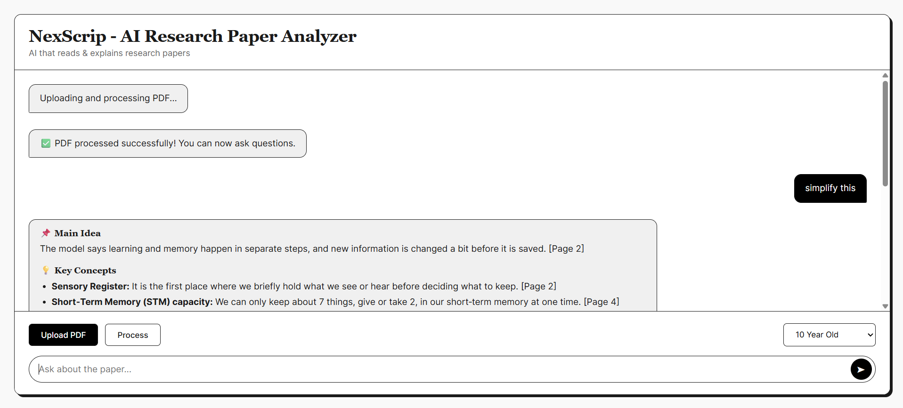
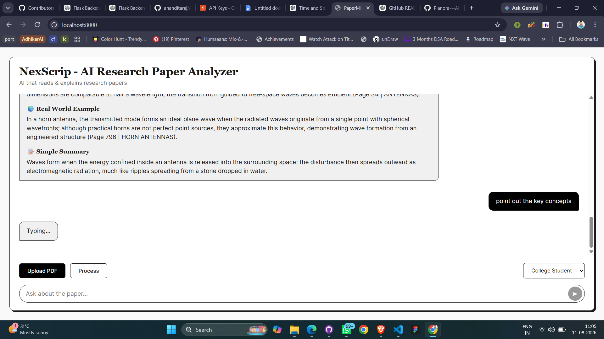

# AI Research Paper Analyzer

> A retrieval-augmented system for querying, understanding, and extracting insights from academic research papers.

The **AI Research Paper Analyzer** transforms research papers into an interactive knowledge base. Users can upload a PDF and ask questions about its contents. Instead of sending the entire document directly to an LLM, the system retrieves the most relevant passages using **semantic and keyword-based search**, then provides the retrieved context to a language model for grounded responses.

---

## 01 — What it does

* Upload academic research papers in PDF format
* Extract and process document text automatically
* Split documents into retrieval-friendly chunks
* Generate semantic embeddings using Sentence Transformers
* Perform vector search with FAISS
* Perform keyword retrieval using BM25
* Combine retrieval results into a relevant context
* Generate contextual responses using the Groq LLM
* Expose the backend through FastAPI
* Provide an interactive web interface and API documentation

---

## 02 — Demo

*The main interface for uploading research papers and asking questions.*

<p align="center">
  
</p>

*Main application interface for uploading papers and querying their content.*

<p align="center">
  
</p>

*End-to-end RAG pipeline showing document processing, hybrid retrieval, and AI response generation.*

<p align="center">
  
</p>

---

## 03 — Technology

| Layer              | Technology            |
| ------------------ | --------------------- |
| Language           | Python                |
| API                | FastAPI               |
| LLM                | Groq                  |
| Embeddings         | Sentence Transformers |
| Semantic Retrieval | FAISS                 |
| Keyword Retrieval  | BM25                  |
| PDF Processing     | PyMuPDF               |
| Frontend           | HTML, CSS, JavaScript |

---

## 04 — Architecture

The system uses a hybrid **Retrieval-Augmented Generation (RAG)** pipeline.

```text
                         RESEARCH PAPER
                               |
                               v
                       +---------------+
                       |  PDF Parsing  |
                       +-------+-------+
                               |
                               v
                       +---------------+
                       | Text Chunking |
                       +-------+-------+
                               |
                    +----------+----------+
                    |                     |
                    v                     v
            +---------------+     +---------------+
            |   Sentence    |     |     BM25      |
            | Transformers  |     |    Ranking    |
            +-------+-------+     +-------+-------+
                    |                     |
                    v                     v
            +---------------+     +---------------+
            |     FAISS     |     |    Keyword    |
            | Vector Search |     |    Search     |
            +-------+-------+     +-------+-------+
                    |                     |
                    +----------+----------+
                               |
                               v
                     +-------------------+
                     | Hybrid Retrieval  |
                     +---------+---------+
                               |
                               v
                     +-------------------+
                     | Relevant Context  |
                     +---------+---------+
                               |
                               v
                     +-------------------+
                     |     Groq LLM      |
                     |  Query + Context  |
                     +---------+---------+
                               |
                               v
                     +-------------------+
                     |   Final Answer    |
                     +-------------------+
```

---

## 05 — Retrieval Strategy

A single retrieval method can miss useful information.

**FAISS** captures semantic similarity, allowing the system to retrieve passages that are conceptually related to a question even when the exact wording differs.

**BM25** complements this with lexical matching, making it effective for technical terminology, names, abbreviations, and exact phrases.

The two retrieval strategies are combined before the context is passed to the LLM.

```text
                    User Question
                         |
              +----------+----------+
              |                     |
              v                     v
        Semantic Search        Keyword Search
              |                     |
            FAISS                  BM25
              |                     |
              +----------+----------+
                         |
                         v
                  Hybrid Context
                         |
                         v
                       LLM
                         |
                         v
                    Answer
```

---

## 06 — Request Flow

```text
Upload PDF
    ↓
Extract text
    ↓
Create chunks
    ↓
Generate embeddings
    ↓
Build FAISS index
    ↓
Build BM25 index
    ↓
Receive user question
    ↓
Retrieve relevant chunks
    ↓
Combine retrieval results
    ↓
Construct LLM context
    ↓
Generate grounded response
```

---

## 07 — Getting Started

### Clone

```bash
git clone https://github.com/<your-username>/AI-Research-Paper-Analyzer.git
cd AI-Research-Paper-Analyzer
```

### Install dependencies

```bash
pip install -r requirements.txt
```

For an isolated environment:

```bash
python -m venv venv
```

**Windows**

```bash
venv\Scripts\activate
```

**Linux / macOS**

```bash
source venv/bin/activate
```

Then:

```bash
pip install -r requirements.txt
```

---

## 08 — Environment

Create a `.env` file in the project root:

```env
GROQ_API_KEY=your_groq_api_key_here
```

Keep credentials outside version control.

```gitignore
.env
venv/
__pycache__/
```

---

## 09 — Run

Start the application:

```bash
python main.py
```

The web application will be available at:

```text
http://localhost:8000
```

Interactive API documentation:

```text
http://localhost:8000/docs
```

---

## 10 — Project Structure

```text
AI-Research-Paper-Analyzer/
│
├── assets/
│   └── demo.png
│
├── static/
│   ├── style.css
│   └── script.js
│
├── templates/
│   └── index.html
│
├── main.py
├── requirements.txt
├── .gitignore
├── .env
└── README.md
```

---

## 11 — Project Objective

Academic papers are often difficult to navigate because important information is distributed across lengthy documents.

This project explores how **retrieval systems and large language models can work together** to make that information accessible through natural-language questions.

The goal is not simply to generate an answer, but to first locate the most relevant information from the source document and then use that context to generate the response.

---

## 12 — Future Work

```text
[ ] Multi-document analysis
[ ] Conversation memory
[ ] Source-level citations
[ ] Document comparison
[ ] Improved retrieval reranking
[ ] Persistent vector storage
[ ] User authentication
[ ] Cloud deployment
[ ] Research-paper summarization
```

---

## 13 — Author

**Anandita Raj**

B.Tech Undergraduate | Software Developer | AI/NLP Enthusiast

Focused on building systems involving **backend development, artificial intelligence, natural language processing, information retrieval, and RAG architectures**.

**GitHub:**
https://github.com/<your-username>

---

## License

This project is intended for educational and research purposes.
